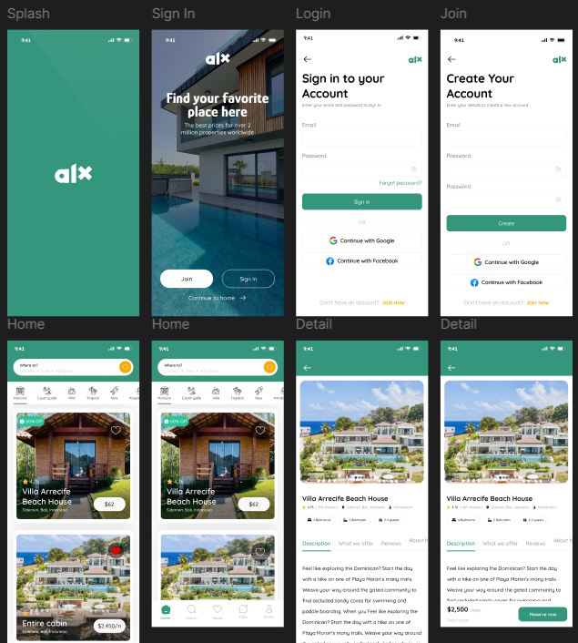

# Figmify: From Wireframe to Prototype

## Introduction
**What is Wireframing?**
Wireframing is a crucial step in the design process, serving as a blueprint or skeletal framework of a website or application. It outlines the basic structure and layout without delving into detailed design elements like colors, fonts, or images. Wireframes focus on the placement of elements, navigation flow, and overall user interface structure.

## Importance of Wireframing in the Design Process
Wireframing plays a vital role in the design process by:

1. **Clarifying Ideas and Concepts**: Wireframing helps translate abstract ideas into tangible representations, allowing designers and stakeholders to visualize the layout and structure of a project early on.

2. **Facilitating Communication**: Wireframes serve as a communication tool among team members, clients, and stakeholders, ensuring everyone is on the same page regarding the design and functionality.

3. **Identifying Usability Issues**: By focusing on the user interface structure, wireframing helps identify potential usability issues early on, such as navigation problems, information hierarchy issues, and interaction flaws.

4. **Saving Time and Resources**: Early detection of design flaws and usability issues saves time and resources that would be spent on revisions later in the design and development stages.

5. **Providing a Clear Layout and Structure**: Wireframes provide a clear and simple representation of the layout, allowing designers to plan the content placement and prioritize elements effectively.

6. **Enabling Easy Modifications**: Making changes to a wireframe is quicker and less costly than altering a high-fidelity design or a developed product, encouraging experimentation and iterative improvement.

7. **Guiding the Design Process**: Wireframes act as a guide for subsequent design and development phases, ensuring that the final product aligns with the initial vision and requirements.

8. **Focusing on Functionality and User Experience**: By stripping away visual design elements, wireframes allow designers to concentrate on the functionality and user experience, ensuring the product is intuitive and user-friendly.

---

## Key Elements in a Wireframe
Wireframes typically include the following key elements:

1. **Layout Structure**  
   Defines the arrangement of elements on the page.  
   *Example:* A well-planned layout ensures critical elements like headers, footers, and sidebars are placed for easy navigation and accessibility.

2. **Navigation**  
   Shows how users will move through the site or application.  
   *Example:* A navigation bar helps users access different sections quickly, improving usability.

3. **Content Placement**  
   Indicates where text, images, and other content will be positioned.  
   *Example:* Placing call-to-action buttons strategically can increase user engagement.

4. **Functionality**  
   Outlines key functionalities and interactions.  
   *Example:* Highlighting a login form or a search bar's interactive elements ensures the interface meets user needs.

---

## Types of Wireframes
There are two main types of wireframes:

1. **Low-Fidelity Wireframes**: Simple sketches or basic digital layouts focusing on overall structure and functionality without detailed design.
2. **High-Fidelity Wireframes**: More detailed and refined versions, often closer to the final design, including more specific layout and design elements.

Low-fidelity wireframes are typically used early in the design process to quickly explore and validate ideas, while high-fidelity wireframes are employed later to refine the design and guide the development phase.

## Wireframe Type in the Provided Image

The image provided appears to depict high-fidelity wireframes, as it shows detailed layouts with specific design elements and functionality, such as navigation, content placement and etc.

---

## Popular Wireframing Tools
There are several wireframing tools available like **Figma**, **Adobe XD**, **Sketch**, **Balsamiq** and **Axure RP**, each with its own set of features and capabilities. One of the most popular and recommended tools for wireframing is **Figma**.

**Figma** is a powerful design and prototyping tool that offers a wide range of features for creating high-quality wireframes and prototypes. It provides a user-friendly interface, real-time collaboration capabilities, and a comprehensive set of design tools that make it easy to create, iterate, and share wireframes with your team and stakeholders.

---

## Benefits of Wireframing in Software Development
Wireframing plays a crucial role in the software development process by:

1. **Guiding the Design Process**: Wireframes provide a clear roadmap for the design and development teams, ensuring that the final product aligns with the initial vision and requirements.
2. **Facilitating Communication**: Wireframes serve as a common language between designers, developers, and stakeholders, enabling effective collaboration and reducing the risk of misunderstandings.
3. **Identifying Usability Issues**: By focusing on the user interface structure and functionality, wireframing helps identify potential usability issues early in the development cycle, allowing for timely and cost-effective resolutions.
4. **Streamlining Development**: Wireframes provide a solid foundation for the development team, reducing the risk of rework and ensuring a smoother implementation process.
5. **Validating Concepts**: Wireframes can be used to validate design concepts with users, gathering feedback that informs the final product and ensures a user-centric approach.

---

## Real-World Scenario: Wireframing and Usability Improvements

In a recent project for a real estate app, the design team created high-fidelity wireframes to map out the user journey for property searches and listings. During the wireframing process, an issue was identified with the property filter functionality, where users were struggling to find and apply the desired filters effectively.

By visualizing the user flow and interaction patterns in the wireframes, the team was able to identify the root cause of the usability problem – the filter options were scattered across multiple tabs, making it difficult for users to access and apply them efficiently.

Through iterative wireframing and user testing, the team was able to consolidate the filter options into a single, easily accessible panel. This improved the overall user experience, allowing users to quickly find and apply the relevant filters to their property searches.

The wireframing process not only helped the team uncover this critical usability issue but also provided a clear roadmap for the development team to implement the refined design. As a result, the final app launched with a more intuitive and user-friendly filtering system, leading to increased user satisfaction and engagement.

This scenario demonstrates the power of wireframing in identifying and resolving usability challenges before the development phase, ultimately ensuring a more polished and user-centric final product.
